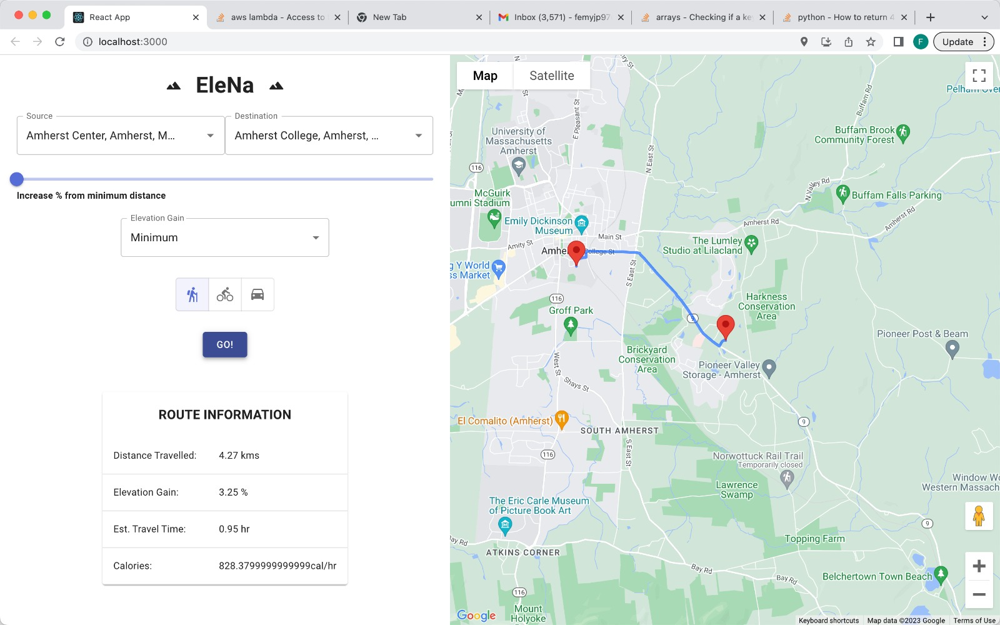

# Elena - Elevation based navigation.

    

## Table of Contents

- [About](#about)
  - [Tech Stack](#tech-stack)
- [Execution](#execution)
  - [Prerequisites](#prerequisites)
  - [Installation](#installation)
- [Components](#components)
- [Contributors](#contributors)

## About
Elena - Elevation Based Navigation is developed as part of CS520 Final Developement Project. 
It aims to provide elevation optimized navigation and routes using Djikstra and A* algorithms.

## Tech Stack
This project tech stack has been selected to implement best software engineering inheritently.
IDE
- [VSCode](https://code.visualstudio.com/)
Backend
- [Flask](https://flask.palletsprojects.com/en/2.2.x/)
- [OpenstreetMap](https://wiki.openstreetmap.org/wiki/OSMPythonTools)

Front-end
- [React.js](https://reactjs.org/)
- [Node.js](https://nodejs.org)

## Execution
To execute the project locally, follow the instructions below

### Prerequisites

- Clone the current repository (main branch)

- Preferrably use VScode as the IDE.

### Installation

- For backend, please read the backend readme in [root/backend/README.md](./backend/README.md)

- For front-end, please read the front-end readme in [root/frontend/README.md](./front-end/README.md)

## Components

- Backend

- Frontend

## Contributors

- Femimol Joseph <[@FJ](https://github.com/femy-joseph)>
- Kritika Kapoor <[@KK](https://github.com/KritikaKapoor13)>
- Prathiksha RV <[@PRV](https://github.com/prathiksharv)>
- Varun Tarikere Shankarappa <[@TSV](https://github.com/varunsdevang)>

